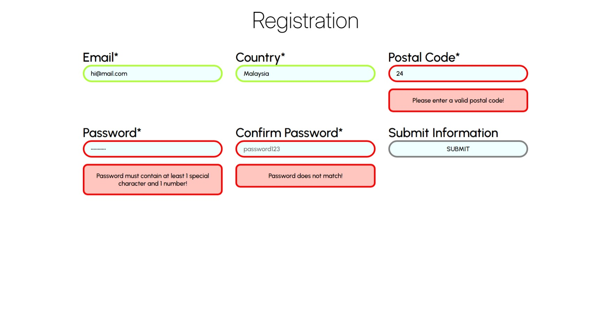
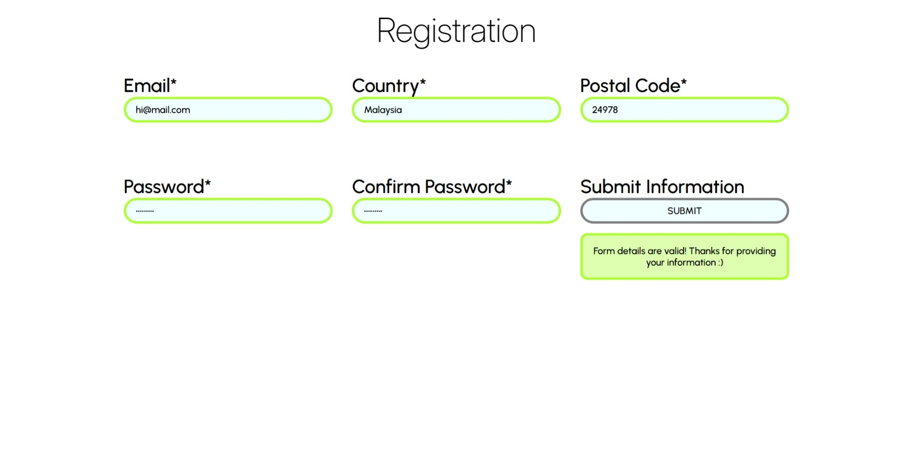
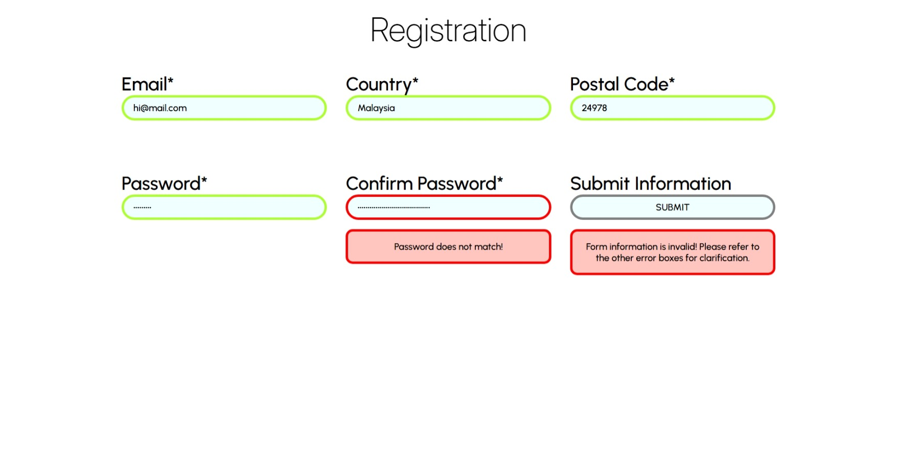
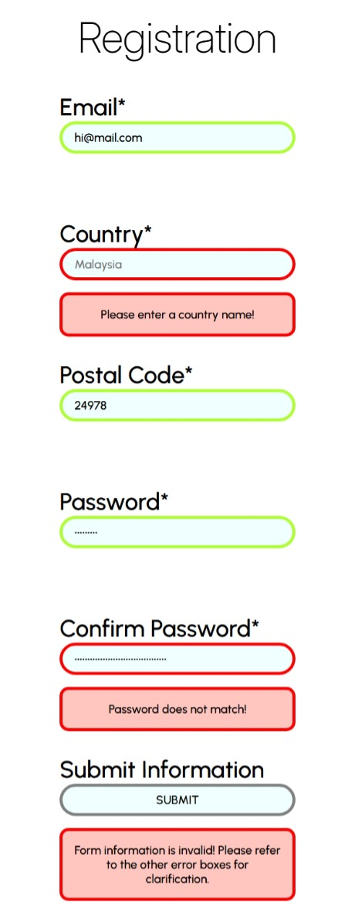

# js-validation-form

Form validation with JavaScript project based on The Odin Project curriculum.

Live demo link: https://j0e-quan.github.io/js-validation-form/

## Technologies used:

- HTML for basic page layout
- CSS for styling elements and use of web fonts (Inter for headings, Urbanist for content)
- JavaScript for validation logic
- npm and webpack for managing and bundling code modules
- Git for version control

## Key features:

- Form inputs are automatically validated as you type
- Inputs have informative error boxes if info is invalid
- Intuitive styles for invalid and valid input boxes
- Layout is somewhat responsive (using Flexbox) and adjusts according to display width

## Gallery:

## Getting started:

1. clone this repo in your desired folder: `git clone https://github.com/J0e-Quan/js-validation-form.git`
2. `npm install` to install any required dependencies
3. `npm run dev` to activate the dev server (View the project by navigating to the localhost address shown in your terminal.)
4. `npm run build` will bundle the code into the 'dist' folder
